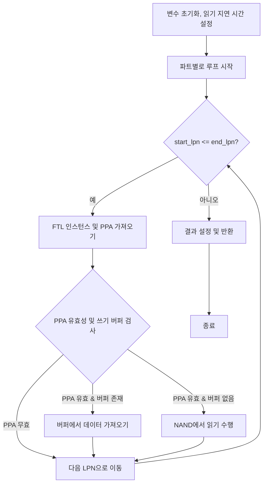
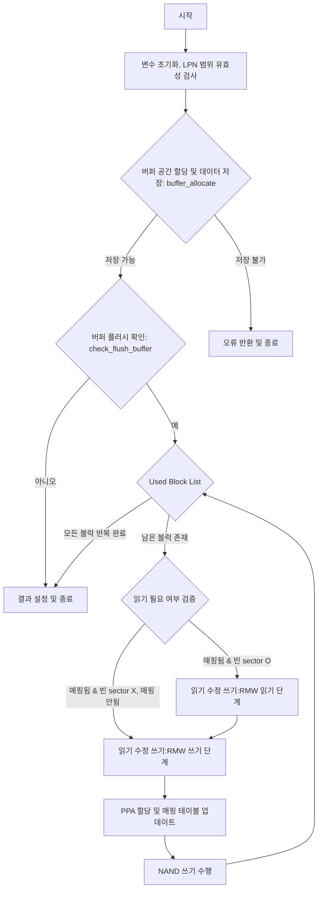
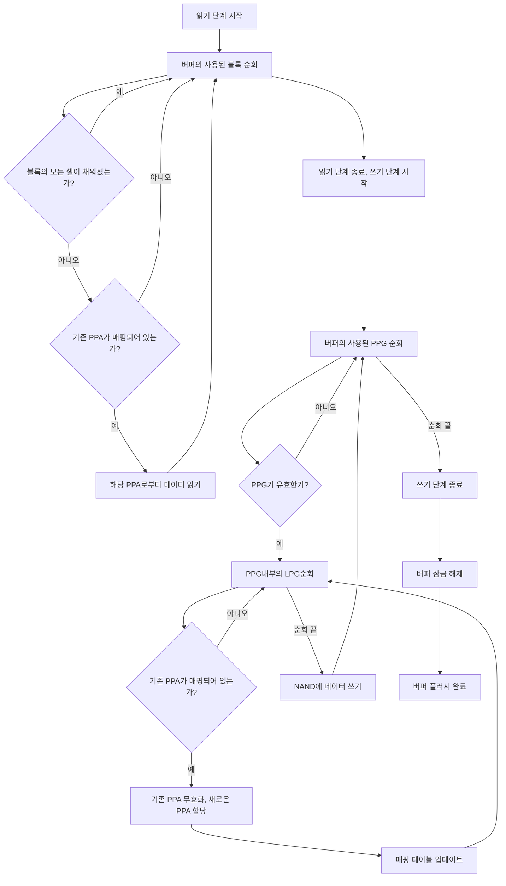

# NVMEVirt 변경사항

## Interleaving Unit

#### Original Virt
```c
// conv_read
static bool conv_read(struct nvmev_ns *ns, struct nvmev_request *req, struct nvmev_result *ret)
{
	...
	conv_ftl = &conv_ftls[start_lpn % nr_parts];
	prev_ppa = get_maptbl_ent(conv_ftl, start_lpn / nr_parts);
	...
}

// conv_write
static bool conv_write(struct nvmev_ns *ns, struct nvmev_request *req, struct nvmev_result *ret)
{
	...
	conv_ftl = &conv_ftls[lpn % nr_parts];
	local_lpn = lpn / nr_parts;
	... 
}
```
기존 Virt에서는 Logical Page 단위로 interleaving이 되었기 때문에 LPN을 `nr_parts`로 나누어 local LPN을 구했고, 모듈러 연산을 통해서 FTL instance의 index를 구했다.

#### Fixed Version
```c
// get ftl instance index
#define GET_FTL_IDX(lpn) (lpn / (FLASH_PAGE_SIZE / LOGICAL_PAGE_SIZE) % SSD_PARTITIONS)
#define LOCAL_LPN(lpn) ((lpn / ((FLASH_PAGE_SIZE / LOGICAL_PAGE_SIZE) * SSD_PARTITIONS))\
		* (FLASH_PAGE_SIZE / LOGICAL_PAGE_SIZE) + (lpn % (FLASH_PAGE_SIZE / LOGICAL_PAGE_SIZE)))
```
Interleaving 단위를 flash page로 맞추기 위해서 lpn의 flash page 내부 주소만큼은 보존되도록 사용해야 한다.

FTL instance의 index의 경우에는 LPN을 `pgs_per_flashpg`로 나누어 해당 LPN이 속한 Flash Page 번호를 얻은 후, 이를 `nr_parts`로 모듈러 연산하여 계산한다.

Local LPN의 경우 LPN을 `(pgs_per_flashpg * nr_parts)`(clustered block의 총 페이지 수)로 나누고 `pgs_per_flashpg `만큼 곱하여, 해당 그룹의 시작 위치를 계산한 다음 offset에 해당하는 `lpn % pgs_per_flashpg`를 추가하여 계산한다.

## Write Buffer

#### Original Virt

```c
struct buffer {
	size_t size;
	size_t remaining;
	spinlock_t lock;
};
```
기존의 write buffer는 모든 ftl instance가 같은 write buffer를 공유하며 현재 buffer의 남아있는 양만을 추적한다.

#### Fixed Version
우선적으로 현대의 ftl에서는 개별 ftl instance가 독립적인 write buffer를 보유하고 있다. 그렇기에 ftl instance별로 개별 write buffer를 가질 수 있도록 하였다.
```c
struct buffer {
	spinlock_t lock;
	int ftl_idx;
	size_t size;
	size_t ppg_per_buf;
	size_t pg_per_ppg;
	size_t sec_per_pg;
	size_t ppg_size;
	size_t pg_size;
	size_t free_pgs_cnt;
	size_t flush_threshold;
	uint64_t complete_time;
	struct list_head free_ppgs;
	struct list_head used_ppgs;
};

struct buffer_ppg {
	bool valid;
	int pg_idx;
	struct buffer_page *pages;
    struct list_head list;
};

struct buffer_page {
	uint64_t lpn;
	bool *sectors;
};
```
수정된 write buffer는 위와 같은 구조를 지닌다. write buffer는 physical page, logical page, sector 단위로 나뉘어서 관리된다. 전체 write buffer는  physical page들의 list로 구성된다. logical page단위가 아니라 physical page 단위로 설정한 것은 추후에 NAND write를 실시할때 phyiscal page 단위로 write를 실시하여  aggregate write를 실현하기 위함이다.

phyiscal page는 다시 logcial page로 나뉘어서 관리된다. 이 부분은 `buffer_ppg`의 `struct buffer_page *pages;`를 통하여 구현하였다. 

logical page는 다시 sector로 나뉜다. buffer_page struct의 bool *sector가 그 역할을 수행한다. sector의 경우에는 512B단위로 나뉘는 메모리 영역을 나타내며 별도의 struct 없이 bool로만 관리된다. buffer상에서 해당 sector에 데이터가 존재한다면 true, 아니면 false로 관리한다.

`flush_threshold`, `complete_time`은 flush에 사용되는 변수들이다. `flush_threshold`는 buffer가 얼마나 찼을때 flush를 진행할 지 결정하는 변수이고 `complete_time`은 해당 buffer의 physical page를 언제 비울것인지 결정하는 변수이다.

## Operations

#### Read Process

`conv_read` 함수는 다음과 같은 과정을 통해서 수행된다.


대부분의 과정이 원본과 동일한 과정을 통해서 수행되나 다음과 같은 부분에서 변경점이 존재한다.
-   **Interleaving Unit &  Logical LPN Calculation**
    - 인터리빙 단위가 Logical Page에서 Flash Page로 변경되었기에 이에 FTL instance index와 logcical LPN의 계산 방식에서 차이가 존재한다.
-   **쓰기 버퍼 확인 여부:**
    -   **Fixed:** `buffer_search` 함수를 사용하여 LPN이 쓰기 버퍼에 있는지 확인하고, 존재한다면 쓰기 버퍼에서 데이터를 가져온다.
    -   **Prev:** 쓰기 버퍼를 확인하는 과정이 존재하지 않는다.

#### Write Process

`conv_write` 함수는 NVMe 쓰기 요청을 처리하여 데이터를 SSD의 쓰기 버퍼에 저장하고, 필요에 따라 버퍼를 플러시하여 NAND 플래시에 기록한다. 함수는 먼저 요청된 LPN 범위가 유효한지 검사하며, 유효하지 않으면 오류를 반환한다. 유효한 경우, 데이터를 쓰기 버퍼에 저장하고 버퍼의 상태를 업데이트한다. 버퍼가 일정 용량 이상 채워지면 플러시가 필요하다고 판단하여 버퍼의 데이터를 NAND 플래시에 기록하는 작업을 수행한다. 마지막으로, 요청의 완료 시간과 상태를 설정하여 반환한다.

이를 그래프로 표현하면 다음과 같다.

RMW 부분을 보다 자세하게 기술하면 다음과 같다.

버퍼가 일정 수준 이상 채워지면 플러시가 필요하다고 판단하고, 버퍼에 대한 잠금을 획득하여 동시 접근을 방지한다.

먼저, 버퍼의 사용된 블록들을 순회하며 각 블록의 모든 셀이 채워졌는지 확인한다. 일부 셀이 비어 있으면, 기존에 매핑된 PPA를 통해 NAND 플래시 메모리에서 데이터를 읽어와 빈 셀을 채운다. 이를 통해 수정된 데이터와 기존 데이터를 통합하여 완전한 페이지를 만든다.

그 다음, 새로운 PPA를 할당받아 매핑 테이블과 역매핑 테이블을 업데이트하고, 기존 PPA를 무효화한다. 완전한 페이지를 NAND에 기록하고 페이지를 유효화하며, 쓰기 포인터를 이동한다. 마지막으로 버퍼 잠금을 해제한다.

원본 코드에서 수정된 부분은 다음과 같다.
1. **쓰기 버퍼**
    -   **버퍼 할당 및 관리:** 수정된 코드는 `buffer_allocate` 함수를 통해 버퍼 공간에 어떤 LPN이  얼마 만큼의 sector를 기록했는지를 추적한다. 그러나 기존 코드는 버퍼에 남은 크기를 추적하였다.
    -   **버퍼 플러시 조건:** 수정된 코드는 버퍼가 절반 이상 채워지면 `check_flush_buffer` 함수를 통해 버퍼를 플러시해야 하는지 한다. 기존 코드는 별도의 버퍼 플러시의 존재 없이 현재 입력된 주소의 ppa가 flash page의 마지막 page의 경우 aggregate write를 수행하였다.

2. **Read-Modify-Write(RMW) 작업의 처리**
	- **RMW 구현:** 버퍼 플러시 시에 Read-Modify-Write 과정을 수행하도록 변경하였다.
    -  **PPA 할당 시점:** 기존의 코드는 요청이 들어온 즉시 PPA를 변환하였다. 그러나 현재는 flush 과정에서 PPA를 할당한다.

3. **NAND 쓰기 작업의 처리 방식**
	-   **버퍼 플러시 시 쓰기:** 기존의 코드는 `last_pg_in_wordline`이라는 함수를 통해서 lpn이 flash page의 마지막 page일 경우 flash page 전체를 write하였다. 그러나 현재는 버퍼를 flush할 때 physical page 단위로 모아서 한번에 NAND write를 수행한다.

#### Buffer Operations

1. `buffer_allocate`
```c
uint32_t  buffer_allocate(struct  ssd  *ssd, uint64_t  start_lpn, uint64_t  end_lpn, uint64_t  start_offset, uint64_t  size) {
	struct  ssdparams  *spp  =  &ssd->sp;
	struct  buffer  *buf  =  &ssd->write_buffer[0];
	struct  buffer_page  *page  =  NULL;
	uint32_t  nr_parts  =  SSD_PARTITIONS;
	uint64_t  pgsz  =  spp->pgsz;
	uint64_t  s_lpn  =  start_lpn;
	uint64_t  e_lpn  =  end_lpn;
	uint64_t  start_size  =  min((spp->secs_per_pg  -  start_offset) *  LBA_SIZE, size);
	size_t  required_pgs[SSD_PARTITIONS] = {0, };
	size_t  ftl_idx;

	for (size_t  i  =  0; (i  <  nr_parts) || (s_lpn  <=  e_lpn); i++, s_lpn  +=  spp->pgs_per_flashpg) {
		ftl_idx  =  GET_FTL_IDX(s_lpn);
		buf  =  &ssd->write_buffer[ftl_idx];
		while (!spin_trylock(&buf->lock))
			;
		
		uint64_t  local_start_lpn  =  s_lpn;
		for(;local_start_lpn  <=  e_lpn; local_start_lpn  +=  spp->pgs_per_flashpg  *  nr_parts) {
			uint64_t  local_end_lpn  =  min(end_lpn, local_start_lpn  +  spp->pgs_per_flashpg  -  1);
			for (uint64_t  lpn  =  local_start_lpn; lpn  <=  local_end_lpn; lpn++) {
				page  =  __buffer_get_page(buf, lpn);

				if (page  ==  NULL) {
					required_pgs[ftl_idx]++;
				}
			}
		}

		if (required_pgs[ftl_idx] >  buf->free_pgs_cnt) {
			spin_unlock(&buf->lock);
			return  -1;
		}
		spin_unlock(&buf->lock);
	}
	
	buf  =  &ssd->write_buffer[GET_FTL_IDX(start_lpn)];
	__buffer_fill_page(buf, start_lpn++, start_size, start_offset);

	for (size  -=  start_size; size  >  pgsz; size  -=  pgsz) {
		buf  =  &ssd->write_buffer[GET_FTL_IDX(start_lpn)];
		__buffer_fill_page(buf, start_lpn++, pgsz, 0);
	}

	buf  =  &ssd->write_buffer[GET_FTL_IDX(start_lpn)];
	__buffer_fill_page(buf, start_lpn, size, 0);

	return  0;
}
```
`buffer_allocate`는 실제 데이터를 버퍼에 쓰는 과정이다. 이 과정은 크게 2부분으로 나뉘는데, 먼저  현재 write buffer에 충분한 공간이 있는지를 확인하고, 만일 공간이 충분하다면 `__fill_buffer`를 이용하여 버퍼에 metadata를 기록한다. 실제 데이터를 옮기는 시간을 계산하는 부분은 `conv_write`의 `ssd_advance_write_bufffer`에서 담당한다.

- `__buffer_get_ppg`
```c
static  struct  buffer_ppg*  __buffer_get_ppg(struct  buffer  *buf, size_t  ftl_idx)
{
	struct  buffer_ppg  *ppg;
	list_for_each_entry(ppg, &buf->used_ppgs, list) {
		if (ppg->valid  &&  ppg->pg_idx  <  buf->pg_per_ppg) {
			return  ppg;
		}
	}

	return  NULL;
}
```
특정 lpn의 데이터가 저장되어 있는 logical page를 반환한다. 만일 존재하지 않는 경우, NULL을 반환한다.

- `__buffer_get_page`
```c
static  struct  buffer_page*  __buffer_get_page(struct  buffer  *buf, uint64_t  lpn)
{
	struct  buffer_ppg  *ppg;
	list_for_each_entry(ppg, &buf->used_ppgs, list) {
		if (ppg->valid) {
			for (int  i  =  0; i  <  buf->pg_per_ppg; i++) {
				if (ppg->pages[i].lpn  ==  lpn) {
					return  &ppg->pages[i];
				}
			}
		}
	}

	return  NULL;
}
```
특정 lpn의 데이터가 저장되어 있는 logical page를 반환한다. 만일 존재하지 않는 경우, NULL을 반환한다.

- `__buffer_fill_page`
	```c
	static void __fill_buffer(struct ssdparams *spp, struct buffer *buf, uint64_t start_lpn, uint64_t start_offset, uint64_t size)
	{
		uint64_t pgsz = spp->pgsz;
		uint64_t start_size = min((spp->secs_per_pg - start_offset) * LBA_SIZE, size);

		/* handle first page */
		__fill_block(buf, start_lpn++, start_size, start_offset);

		for (size -= start_size; size > pgsz; size -= pgsz) {
			__fill_block(buf, start_lpn++, pgsz, 0);
		}

		/* handle last page */
		__fill_block(buf, start_lpn, size, 0);
	}
	```
	버퍼에 메타 데이터를 기록하는 함수이다. 첫번째 호출과 두번째 호출의 경우에는 align되지 않을 가능성이 존재하기 때문에 별도로 존재하고 중앙 부분은 offset과  size가 일정하므로 반복문으로 처리하였다.
	
- `__fill_block`
```c
static  void  __buffer_fill_page(struct  buffer  *buf, uint64_t  lpn, uint64_t  size, uint64_t  offset)
{
	if (size  ==  0) return;

	while (!spin_trylock(&buf->lock))
		;

	struct  buffer_ppg*  ppg;
	struct  buffer_page  *page  =  __buffer_get_page(buf, lpn);

	if (page  ==  NULL) {
		ppg  =  __buffer_get_ppg(buf, lpn);
		if (ppg  ==  NULL) {
			ppg  =  list_first_entry(&buf->free_ppgs, struct buffer_ppg, list);
			list_move_tail(&ppg->list, &buf->used_ppgs);
		}
		page  =  &ppg->pages[ppg->pg_idx++];
		buf->free_pgs_cnt--;
	}

	page->lpn  =  lpn;
	
	for (size_t  i  =  0; i  <  size  /  LBA_SIZE; i++) {
		page->sectors[i  +  offset] =  true;
	}

	spin_unlock(&buf->lock);
}
```
한개의 logical page에 LPN의 메타 데이터를 기록하는 부분이다. 우선 기존의 block이 있는지 검사하고 없으면 새로운 block을 freelist로 부터 추출한다. 추출된 block의 LPN과 sector 부분을 마킹한다. sector 부분은 LBA(512B) 단위의 sector를 기록하는 부분이다.

2. `buffer_release`
```c
bool  buffer_release(struct  buffer  *buf, uint64_t  complete_time)
{
	while (!spin_trylock(&buf->lock))
		;

	struct  buffer_ppg  *block, *tmp;
	list_for_each_entry_safe(block, tmp, &buf->used_ppgs, list) {
		if (!block->valid  &&  block->complete_time  ==  complete_time) {
			list_move_tail(&block->list, &buf->free_ppgs);
			block->complete_time  =  0;
			block->valid  =  true;
			for (size_t  i  =  0; i  <  block->pg_idx; i++) {
				block->pages[i].lpn  =  INVALID_LPN;
				for (size_t  j  =  0; j  <  buf->sec_per_pg; j++) {
					block->pages[i].sectors[j] =  false;
			}
		}
		buf->free_pgs_cnt  +=  block->pg_idx;
		block->pg_idx  =  0;
		}
	}

	spin_unlock(&buf->lock);

	return  true;
}
```
전체 버퍼를 순회하면서 valid가 false로 되어있는 block을 free 상태로 되돌린다. valid의 경우에는 `conv_write`의 RMW과정에서 삭제 대상인 block에 대해서 false 로 표기한다. 